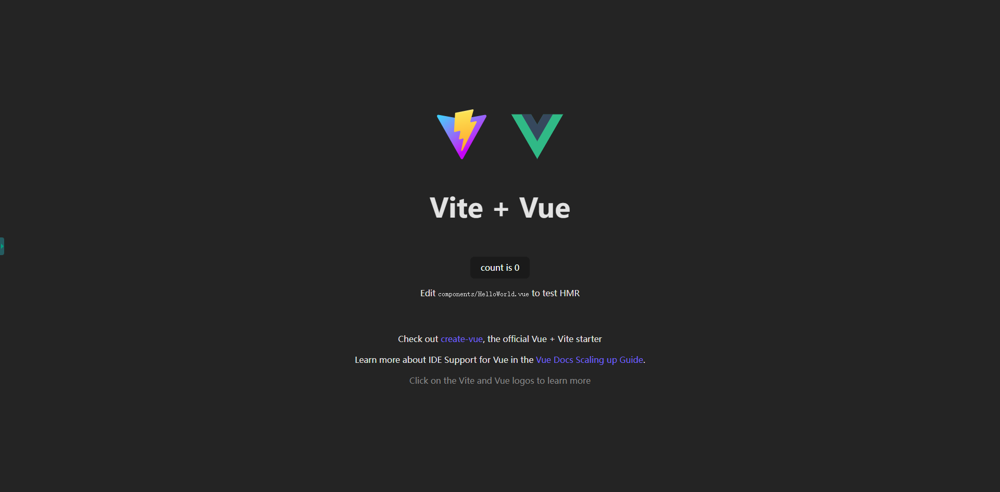

# onesystem

## 一、创建1个vue应用
1. 首先确保你已经安装了 Node.js（建议版本 14.18+ 或 16+）
2. 打开终端，运行以下命令创建 Vite 项目：
```bash
# 使用 npm
npm create vite@latest
```
3. 按照终端提示进行配置：
- 输入项目名称（例如 my-vite-app）
- 选择框架（如 React、Vue、Vanilla 等）
- 选择变体（如 TypeScript 或 JavaScript）
4. 进入项目目录并安装依赖：
```bash
cd my-vite-app
npm install
```
5. 启动开发服务器：
```bash
npm run dev
```
6. 访问开发服务器： http://localhost:5173/
