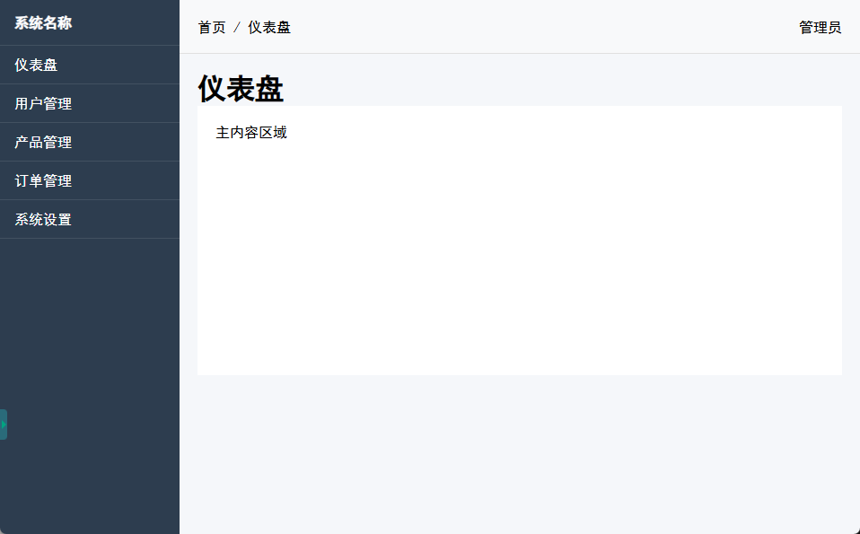

# onesystem

## 一、创建1个vue应用

1. 首先确保你已经安装了 Node.js（建议版本 14.18+ 或 16+）
2. 打开终端，运行以下命令创建 Vite 项目：

```bash
# 使用 npm
npm create vite@latest
```

3. 按照终端提示进行配置：

- 输入项目名称（例如 my-vite-app）
- 选择框架（如 React、Vue、Vanilla 等）
- 选择变体（如 TypeScript 或 JavaScript）

4. 进入项目目录并安装依赖：

```bash
cd my-vite-app
npm install
```

5. 启动开发服务器：

```bash
npm run dev
```

6. 访问开发服务器： http://localhost:5173/
   

## 二、布局

### 逻辑分析

#### 整体布局框架：明确 1个核心原则

中后台布局的本质是：**功能入口+信息展示 的分离**

- 左侧/顶部放 功能入口（告诉用户 “能做什么”）
- 中间大区域放 信息内容（告诉用户 “当前在处理什么”），避免操作和内容混乱。
  最经典的框架是**“侧边栏（功能入口）+顶部标题栏（全局控制）+主内容区（核心业务）”**，常见的管理后台（如阿里云控制台、OA系统）都基于这个框架衍生。

#### 5个核心布局模块的业务内容

1. **侧边栏（Sidebar）：功能导航中心**
   业务定位：存放系统所有核心功能的入口，是用户“找功能”的主要渠道。
   核心业务内容：

- 品牌/系统标识：顶部通常放系统Logo+名称（如
  “XX电商管理后台”），强化认知，避免多系统切换时混淆。
- 功能菜单列表：按业务模块分组，比如电商后台会分 商品管理、订单管理、用户管理、营销活动等，每个分组下再放具体功能（如 商品管理 下有 商品列表、新增商品、分类管理）。
- 状态标识：当前正在使用的功能会高亮（如深色背景），帮用户快速定位“自己在哪”（如用户在订单列表页，侧边栏对应选项就会高亮）
- 折叠功能：窄屏时可折叠成仅显示图标（节省空间），宽屏时展开显示文字+图标（降低记忆成本）。适配不同屏幕尺寸的办公场景。
  业务价值：解决了“功能太多找不到”的问题。

2. **顶部标题栏（Top Bar/header）：全局控制中心**
   业务定位：存放所有“跨模块的全局操作”，不绑定具体业务页面，任何页面都可以快速调用。
   核心业务内容：

- 页面标题：显示当前所在页面的名称（如 订单列表-待发货订单），帮用户确认当前操作场景（避免迷路）。
- 全局搜索：支持搜索全系统的关键信息（如用户ID、订单号、页面名称），比如运营人员想快速找到某笔异常订单，不用先进入 订单管理 再筛选，直接在顶部搜索即可。
- 快捷操作：高频的跨模块功能，比如 新增数据（如新增用户、新增商品）、数据导出、刷新。
- 用户与系统入口：
  - 用户相关：头像、用户名、退出登录、个人设置（如修改密码）
  - 系统相关：通知提醒、系统设置（如主题切换、权限切换）
    业务价值：解决”全局操作需要来回跳转“的问题，将高频跨模块功能集中在顶部，减少用户的操作路径。

3. **主内容区（Main Content）：核心业务操作区**
   业务定位：系统的主战场，所有的具体业务操作和信息展示都在这里完成，是布局中面积最大的区域。
   核心业务内容：

- 业务页面：根据侧边栏的功能导航，动态加载不同的业务页面（如 商品列表页、订单详情页）。每个页面都有自己的布局和组件，但整体风格要统一。
- 操作区域：每个业务页面通常包含数据列表、表单、图表等组件，用户可以在这里进行各种操作（如新增、编辑、删除、查看详情）。
- 分页、筛选与搜索：对于数据量大的数据列表页，提供分页、筛选、搜索、排序等功能，帮助用户快速找到目标数据。
- 反馈与提示：操作成功或失败后，及时给出反馈（如弹窗、消息提示），确保用户知道当前状态。
  业务价值：聚焦当前业务，不被其他模块干扰。

4. **面包屑导航（Breadcrumb）：路径定位工具**
   业务定位：通常放在”顶部标题栏下方、主内容区上方“，告诉用户”当前页面在系统中的位置“，尤其适合层级深的系统。
   核心业务内容：

- 按层级展示路径：比如 ”首页-商品管理-商品列表-编辑商品“
- 每个路径节点可点击跳转
  业务价值：帮助用户了解自己在哪，方便跳转到上级页面，减少迷路。

5. **操作栏（Action Bar）：页面级快捷操作区**
   业务定位：绑定当前主内容区的页面，存放”仅在当前页面生效的高频操作“，区别于顶部标题栏的”全局操作“
   核心业务内容：

- 表格页面：批量删除、批量导出、批量修改状态、搜索、筛选
- 表单页面：保存、重置、预览、返回
- 详情页面：编辑、删除、返回
  业务价值：把当前页面的高频操作放在内容区顶部，避免用户在页面内来回滚动找按钮，提高效率

总结：侧边栏帮你 找到要做的事（找功能）--> 顶部标题栏帮你 做全局的事（全局操作）--> 面包屑帮你 知道在哪（定位路径）--> 主内区帮你 开始做事（业务）--> 操作栏帮你 更方便做事（页面级操作）


### 布局技术
有2类布局技术：Flex、Grid
#### Flex

通过给元素（比如div+类名）设置css属性：`display: flex;`，使其成为Flex 容器，而Flex 容器的直接子元素（不包括嵌套的后代元素）会自动成为 Flex 项目。作为一种一维布局模型，Flex 通过配置 Flex 容器属性（如 `justify-content: center;`控制主轴对齐）和 Flex 项目属性（如 `align-self: center;`控制单个项目的交叉轴对齐），可以灵活实现各种复杂的布局效果。

1、基本布局
实现效果：

实现步骤：

- 在src/components下创建1个Vue组件BaseLayout.vue
- BaseLayout.vue：在 `<template>`内创建1个div，设置类名为app-container
  - 在 `<style scoped>`内给 `.app-container`设置css属性：
    - `display: flex;`：使得app-container类的div成为flex容器
    - `height: 100vh;`：让容器高度撑满整个视觉窗口
- BaseLayout.vue：在div.app-container内创建2个元素，侧边栏 aside元素（类名为sidebar）、主内容区域 div元素（类名为main-container）
  - 在 `<style scoped>`内给3个类（sidebar、topbar、main-container）设置css属性：
    - `.sidebar`：
      - `width: 200px;`：宽度为200像素
      - `background-color: #2c3e50;`：背景色为深蓝色
      - `color: white; `： 文字颜色为白色
    - `.main-container`：
      - `flex: 1;`：常用的简写属性，让主内容区占据剩余空间，常用于自适应布局
      - `display: flex;`：使得main-container类的div成为flex容器
      - `flex-direction: column;`：将Flex项目（也就是Flex容器的一级子元素）按垂直方向从上到下排列
- BaseLayout.vue：在div.app-container.div.main-container内创建2个元素，顶部标题栏 header元素（类名为top-nav）、页面内容区 main元素（类名为page-content）
  - 在 `<style scoped>`内给.top-nav设置css属性：
    - `height: 60px;`：高度为60像素
    - `background-color: #f8f9fa;`：背景色为白色
    - `border-bottom: 1px solid #e0e0e0;`：设置一条 1像素宽、实线样式、颜色为浅灰色的底部边框
    - `display: flex;`：成为flex容器
    - `justify-content: space-between;`：使主轴上的Flex项目两端对齐，Flex项目之间间隔相等
    - `align-items: center;`：在交叉轴方向上居中对齐
    - `padding: 0 20px;`：上下内边距为 0、左右内边距为20像素
  - 在 `<style scoped>`内给.page-content设置css属性：
    - `flex: 1;`：占据剩余空间
    - `padding: 20px;`：四周内边距为20像素
    - `background-color: #f5f7fa;`：背景色为浅灰色
    - `overflow-y: auto;`：当元素内容垂直方向超出自身范围时，自动显示垂直滚动条
- BaseLayout.vue：在div.app-container.div.main-container.main.page-content 内创建1个元素，主内容区域 div元素（类名为content-area）
  - 在 `<style scoped>`内给.content-area设置css属性：
    - `padding 20px;`：四周内边距为20像素
    - `background-color: white;`：背景色为白色
    - `min-height: 300px;`：元素高度不能小于300像素
- BaseLayout.vue：还有有其他一些业务组件的样式需要通过类来统一设置，比如侧边栏aside下的功能列表。一般通过设置 padding 来美化元素内容显示、border-bottom 提现元素位置。
- 在src/styles下创建1个css文件global.css，内容为：

```css
html, body {
  margin: 0; /* 外边距（元素与其他元素之间的空间）设置为  0*/
  padding: 0; /* 内边距（元素内容与元素边框之间的空间）设置为 0 */
  height: 100%; /* 确保根元素占满屏幕高度 */
}
* {
  box-sizing: border-box; /* 让元素的宽高包含内边距和边框，避免布局问题 */
  margin: 0;
  padding: 0;
}
```

避免被浏览器修改了基本样式

- 在src/main.js内导入global.css：`import './styles/global.css'`
- 在App.vue内使用BaseLayout.vue：

```vue
<template>
  <BaseLayout />
</template>

<script setup>
import BaseLayout from './components/BaseLayout.vue'
</script>
```
